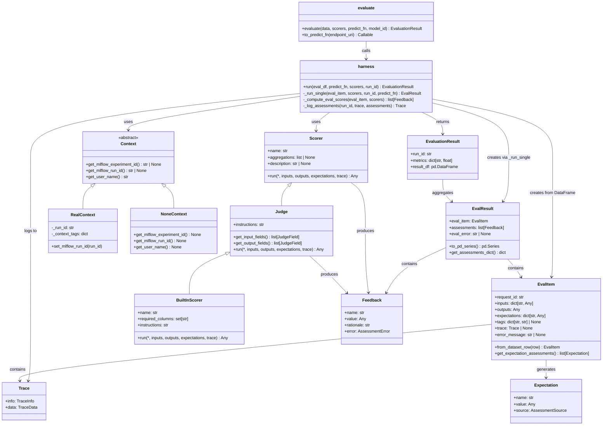

# MLflow Evaluation Framework Analysis

## Overview
MLflow has two main evaluation frameworks for different use cases:

1. **Traditional ML Evaluation** (`mlflow.models.evaluation`)
   - Location: `mlflow/models/evaluation/`
   - Entry point: `mlflow.models.evaluation.base.evaluate()`
   - Purpose: Evaluates traditional ML models (classifiers, regressors, etc.)
   - Key Components:
     - `base.py` - Core evaluation infrastructure, `EvaluationResult`, `ModelEvaluator` interface
     - `default_evaluator.py` - Default evaluator implementation
     - `evaluators/` - Specialized evaluators:
       - `classifier.py` - Classification model evaluator
       - `regressor.py` - Regression model evaluator
       - `shap.py` - SHAP explainability evaluator
     - `evaluator_registry.py` - Registry for evaluators
     - `validation.py` - Metric validation and thresholds
     - `artifacts.py` - Evaluation artifacts (plots, tables, etc.)

2. **GenAI Evaluation** (`mlflow.genai.evaluation`)
   - Location: `mlflow/genai/evaluation/`
   - Entry point: `mlflow.genai.evaluate()` in `base.py`
   - Purpose: Evaluates generative AI models/applications
   - Key Components:
     - `base.py` - Main `evaluate()` function and `to_predict_fn()` helper
     - `harness.py` - Evaluation harness that runs predictions and scoring in parallel
     - `context.py` - Evaluation context management
     - `entities.py` - Evaluation data structures (`EvalItem`, `EvalResult`, etc.)
     - `utils.py` - Utility functions for data conversion and processing
     - `telemetry.py` - Telemetry tracking

## Directory Structure

```
mlflow/
├── models/evaluation/                             # Traditional ML Evaluation
│   ├── base.py                                    # Core infrastructure, evaluate() entry point
│   ├── default_evaluator.py                       # Default evaluator implementation
│   ├── evaluator_registry.py                      # Evaluator registration
│   ├── validation.py                              # Metric validation & thresholds
│   ├── artifacts.py                               # Evaluation artifacts (plots, tables)
│   ├── evaluators/                                # Specialized evaluators
│   │   ├── classifier.py                          # Classification evaluator
│   │   ├── regressor.py                           # Regression evaluator
│   │   └── shap.py                                # SHAP explainability evaluator
│   └── utils/
│       ├── metric.py                              # Metric utilities
│       └── trace.py                               # Trace integration
│
├── genai/
│   ├── evaluation/                                # GenAI Evaluation Framework
│   │   ├── base.py                                # Main evaluate() entry point
│   │   ├── harness.py                             # Parallel prediction & scoring harness
│   │   ├── context.py                             # Evaluation context management
│   │   ├── entities.py                            # EvalItem, EvalResult data structures
│   │   └── utils.py                               # Data conversion utilities
│   │
│   ├── scorers/                                   # Scoring Functions
│   │   ├── base.py                                # Scorer base class & @scorer decorator
│   │   ├── builtin_scorers.py                     # Built-in scorers (Correctness, Safety, etc.)
│   │   ├── aggregation.py                         # Metric aggregation
│   │   ├── registry.py                            # Scorer registration
│   │   └── validation.py                          # Scorer validation
│   │
│   ├── judges/                                    # LLM-based Judges
│   │   ├── base.py                                # Judge base class
│   │   ├── builtin.py                             # Built-in judge functions
│   │   ├── make_judge.py                          # Custom judge factory
│   │   ├── custom_prompt_judge.py                 # Custom prompt judge
│   │   ├── adapters/                              # LLM provider adapters
│   │   │   ├── databricks_adapter.py
│   │   │   ├── gateway_adapter.py
│   │   │   └── litellm_adapter.py
│   │   ├── prompts/                               # Evaluation prompt templates
│   │   └── tools/                                 # Trace access tools for judges
│   │
│   └── datasets/                                  # Evaluation Datasets
│       ├── evaluation_dataset.py
│       └── databricks_evaluation_dataset_source.py
│
├── data/
│   └── evaluation_dataset.py                      # General evaluation dataset support
│
├── evaluation/                                    # ⚠️ DEPRECATED (removed in MLflow 3.0)
│   ├── evaluation.py                              # Legacy Evaluation class
│   ├── assessment.py                              # Legacy Assessment class
│   └── fluent.py                                  # Legacy fluent API
│
└── entities/
    └── assessment.py                              # Modern assessment classes (use instead of mlflow.evaluation)

examples/evaluation/                               # Evaluation examples
```

## Supporting Components

### Scorers (`mlflow.genai.scorers`)
- Location: `mlflow/genai/scorers/`
- Purpose: Scoring functions for GenAI evaluation
- Key Components:
  - `base.py` - `Scorer` base class and `@scorer` decorator
  - `builtin_scorers.py` - Built-in scorers (Correctness, Safety, RetrievalRelevance, etc.)
  - `aggregation.py` - Metric aggregation functions
  - `registry.py` - Scorer registration system
  - `validation.py` - Scorer validation

### Judges (`mlflow.genai.judges`)
- Location: `mlflow/genai/judges/`
- Purpose: LLM-based judges for GenAI evaluation
- Key Components:
  - `base.py` - `Judge` base class
  - `builtin.py` - Built-in judge functions
  - `make_judge.py` - Factory for creating custom judges
  - `adapters/` - Adapters for different LLM providers (Databricks, Gateway, LiteLLM)
  - `prompts/` - Prompt templates for different evaluation criteria
  - `tools/` - Tools for judges to access trace information

### Evaluation Datasets
- Locations: `mlflow/data/evaluation_dataset.py` and `mlflow/genai/datasets/evaluation_dataset.py`
- Purpose: Dataset handling for evaluation workflows

## Legacy Module
- `mlflow.evaluation/` is **DEPRECATED** (will be removed in MLflow 3.0)
- Contains legacy `Evaluation` and `EvaluationEntity` classes
- New code should use `mlflow.entities.assessment` instead

## GenAI Evaluation Framework Analysis

### Main Classes

**Core Evaluation Classes:**
- `evaluate()` - Main entry point function in `base.py`
- `harness.run()` - Evaluation harness orchestrator that runs predictions and scoring in parallel
- `EvalItem` (dataclass) - Represents a single row in the evaluation dataset with inputs, outputs, expectations, trace
- `EvalResult` (dataclass) - Holds evaluation result for a single eval item including assessments
- `EvaluationResult` (dataclass) - Final evaluation result containing run_id, aggregated metrics, and result DataFrame

**Context Management:**
- `Context` (ABC) - Abstract base class for execution context
- `RealContext` (Context) - Actual context implementation providing MLflow run/experiment access
- `NoneContext` (Context) - Null context for testing

**Scorer Classes:**
- `Scorer` (BaseModel) - Base class for all scorers with name, aggregations, description
- `BuiltInScorer` (Judge) - Base class for built-in scorers (Correctness, Safety, etc.)
- Built-in scorer implementations: `Correctness`, `Safety`, `RetrievalRelevance`, `RetrievalSufficiency`, `RetrievalGroundedness`, `Guidelines`, `Equivalence`, `RelevanceToQuery`

**Judge Classes:**
- `Judge` (Scorer) - Base class for LLM-based judges, extends Scorer
- `BuiltinJudge` - Built-in judge implementation
- `AlignmentOptimizer` (ABC) - Abstract base for judge optimizers

**Supporting Entities:**
- `Trace` - MLflow trace entity (from `mlflow.entities`)
- `Assessment`, `Feedback`, `Expectation` - Assessment entities (from `mlflow.entities.assessment`)

### Component Relationships



## Examples
- Location: `examples/evaluation/`
- Contains examples for both traditional and GenAI evaluation
